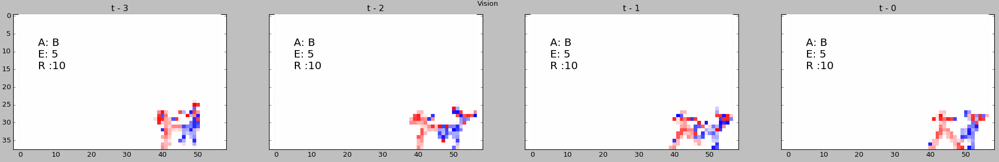
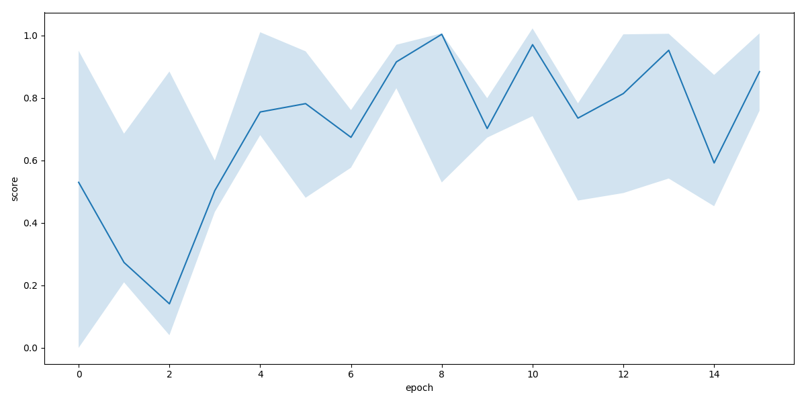
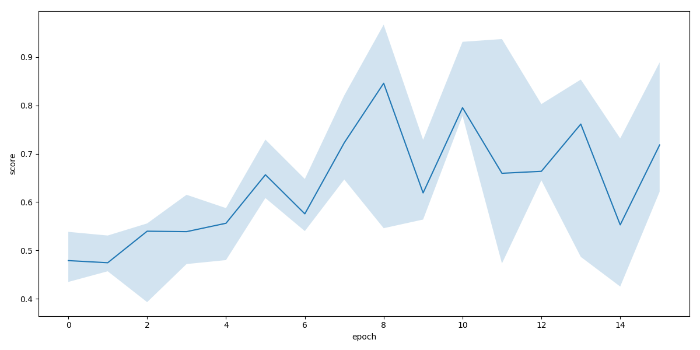

# Basic Deep Q-learning Bot for Fighting ICE AI platform

This is a simple description of example Deep Q-learning (DQN[^1]) AI for Fighting Game AI platform[^2]. We implement very simple Deep Q-learning algorithm with replay memory. BasicBot collect state and action pair through game playing and store it replay memory. To speed up this process, we run multiple games in parallel. Simultaneously, main thread of training program update Q-function (neural network) using collected data. The neural network has two convolution layers and two fully connect layers. It determines which action is the best action based on game screen input and current energy value.

We train this bot against SandBag Bot (no action) and DisplayInfo Bot (simple scripted bot). Although we can't show outperformed performance against DisplayInfo, but BasicBot shows approaching behavior very soon in a game with SandBag. It implies BasicBot can learn simple task (move toward to opponent and attack).

We launch multiple games in training phase to increase data gathering speed. Since we can't control game flow freely and skip redundant time consuming for keeping game frame rate, we have to wait each frame to collect one data tuple ($s_1, a, s_2, r$). Instead we can collect data from another game with multi instance. Even though there are advanced method [^3] using multiple instance of game for reinforcement learning, but we use standard DQN with replay memory, therefore there are no big changes except data gathering process.

Although we don't have explicit experimental results yet, however empirically we think using multiple instance is faster than single instance. Of course, it is not helpful enough if there are limited computing resources, Usually DQN needs GPU quite good GPU and enough memory for replay memory. But to running multiple game instances we need all kinds of resources (GPU, CPU, and RAM). One Fighting Game AI platform needs at least single core of CPU and about 3~6 GB memory. Usually it is the bottleneck of this approach. For instance, in a common PC around us, it has four CPU cores and 32 GB memory. In this case, we can run game only three times faster. Other one core needs for neural network training and other jobs. Also, we have to remain computing resource to keep game's frame rate. Because we can't control time in each game. It is possible that data from game is corrupted when the game is delayed.

## Environment setting

**Simple explanation of each file**

- BasicBot.py
  - AI implementation and training code
- BasicBot.pt
  - Pretrained AI (PyTorch neural network's weights)
- run.py
  - Batch file for experiment (5 times experiments with SandBag)
- DisplayInfo.py and SandBag.py
  - Opponent AI for training
- Main_PyAIvsPyAI_BasicBotvcDisplayInfo_6000.py
  - Execute AI client code
- README.md, README.pdf
  - This file

**Installation**

  Copy all files to Python directory in FTG3.xx
```
─┬ FightingICEver3.xx
 └ Python      <-- copy to here
```

or

```
─┬ FightingICEver3.xx
 ├ Python
 └ BasicBot      <-- copy to here
```

**Requirements**

 - Ubuntu 14.04 or higher
   - To setup for windows, probably needs little modification
 - python 3.5 (recommend anaconda3, https://www.continuum.io/downloads)
 - Nvidia CUDA 8.0 and PyTorch (http://pytorch.org/)
 - py4j (https://www.py4j.org/)

**Install dependancies setting running environment**
 ```bash
 # install anaconda3
 wget https://repo.continuum.io/archive/Anaconda3-4.3.1-Linux-x86_64.sh
 sh bash Anaconda3-4.3.1-Linux-x86_64.sh

 # create conda environment
 conda create -n ftg python=3.5

 # install py4j
 conda install -c conda-forge py4j

 # install pytorch for cuda 8.0
 conda install pytorch torchvision cuda80 -c soumith

 # (optional) install tqdm
 pip install tqdm

 # (optional) install matplotlib
 conda install matplotlib

 # (optional) install pygame
 conda install -c CogSci pygame
 ```

## Neural Netowork Architecture

```mermaid
graph LR
  Screen -.n x 4 x 38 x 57.-> Conv1
  subgraph Conv1
    Conv1 --> Relu1(ReLU)
  end
  Relu1 -.n x 8 x 11 x 18.-> Conv2
  subgraph Conv2
    Conv2 --> Drop1(Dropout 0.5)
    Drop1 --> Relu2(ReLU)
  end
  Relu2(ReLU) -.n x 8 x 5 x 8.-> Flatten>Flatten]

  Screen(Screen)
  style Screen stroke-width:4px
```

```mermaid
graph LR
  Flatten>Flatten] -.n x 320.-> FC1
  subgraph FC1
    FC1 -.n x 128.-> Relu3(ReLU)
  end
  Relu3 -.n x 128.-> FC2
  Energy -.1.-> FC1
  subgraph FC2
    FC2 --> Drop2(Dropout 0.5)
    Drop2 --> Relu4(ReLU)
  end
  Relu4(ReLU) -.n x 3.-> Action

  Energy(Energy)
  style Energy stroke-width:4px
  Action(Action)
  style Action stroke-width:4px
```
- n
  - Number of sample in mini batch
- Screen (Input)
  - current and previous three gray scaled screen image
  - Resolution: $38 \times 57$, higher resolution needs more time to get image
  - Opponent player values are inverted
  - All pixel values are normalized [-1, 1]
- Energy (Input)
  - Divide by 300 to normalize
  - Single float point value
- Conv1
  - 2d convolution layer: # of filter: 8, kernel size: 6, stride: 3
- Conv2:
  - 2d convolution layer: # of filter: 8, kernel size: 3, stride: 2
- FC1:
  - Fully connected layer: # of node 128
- FC2:
  - Fully connected layer: # of node 3
- Action (output)
  - Each node's output represent 3 type of action's Q-value
  - Actions: Left (LLLL), Right (RRRR), Action B (B B )

## Training and testing

**Activate conda environment**
```bash
:~$ source activate ftg
```

**Training with SandBag AI**

```bash
(ftg) :~$ python BasicBot.py train --max-epoch 15 --training-step 30000 --evaluation-sec 120 --opponent SandBag --n-cpu 2 --path output/SandBag-n --render single --monitor matplotlib
```
SandBag (do nothing) AI is the easiest AI for training. After few minutes, BasicBot pursuit SandBag and hit, although it is not optimal movement. After one hour, It shows the best performance and it became worse after further training (Fig. 2).

- train: set 'train' or 'test' mandatory
- max-epoch: set how many times repeat training and evaluation
- training-step: set how many frame use for training
- evaluation-sec: set how many time(seconds) use for evaluation (testing) without learning
- opponent
  - opponent name
  - Python bot: opponent class name and filename should be same and it placed in same directory
  - Java bot: should be add character type like 'MctsAi:LUD', however it is not test enough
- n-cpu: set how many games launch, it should lower than number of CPU cores, also considering limits of other computing resources
- path: BasicBot.py create this directory if it is not existing and write csv file as a log and store networks parameters
- render
  - single: render one of game only
  - all: render all games
  - none: disable rendering
- monitor
  - matplotlib: show current input images, energy and output action using matplotlib (Fig. 1)
  - pygame: show current input images using pygame module
  - none: disable monitor


<center>Fig. 1. example of matplotlib monitor image</center>

If you want to know about the options
```bash
(ftg) :~$ python BasicBot.py --help
```

We use score in each evaluation phase to measure performance, score is the average value of certain duration, in this case evaluation phase (30 sec.) of each epoch. We define reward function that subtract from opponent's hp decrease to my hp decrease and divided by 30 for scaling.

$$ r_t = \frac{(OppHP_{t-1} - OppHP_t) - (MyHP_{t-1} - MyHP_t)}{30} $$

$$ score = \frac{1}{N} \sum_{t=1}^{N}{r_t}$$

Fig. 2., Fig. 3. and Fig. 4. show training results (average, max and min score of 5 times training). A training take about 2 hour.


<center>Fig. 2. Testing score</center>


<center>Fig. 3. Training score</center>


<center>Fig. 4. Testing loss</center>


**Testing with SandBag AI**

```bash
(ftg) :~$ python BasicBot.py test --opponent SandBag --path . --render single --monitor matplotlib
```

Basically, it finds BasicBot.pt (parameter file) from --path directory, if --path is not set then find current working directory.

Also BasicBot.py implements AIInterface too, it is working well with Main_PyAIvsPyAI_BasicBotvcDisplayInfo_6000.py. In this case BasicBot.py find parameter file in current working directory.


[^1]: V. Mnih et al., “Playing Atari with Deep Reinforcement Learning,” arXiv:1312.5602 [cs], Dec. 2013.
[^2]: “Welcome to Fighting Game AI Competition.” [Online]. Available: http://www.ice.ci.ritsumei.ac.jp/~ftgaic/. [Accessed: 17-Mar-2017].
[^3]: V. Mnih et al., “Asynchronous Methods for Deep Reinforcement Learning,” arXiv:1602.01783 [cs], Feb. 2016.
